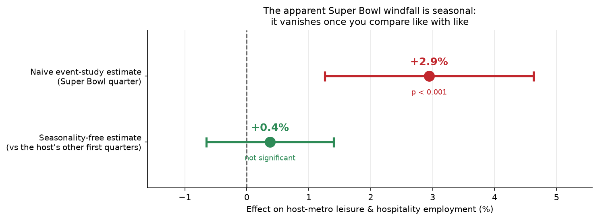
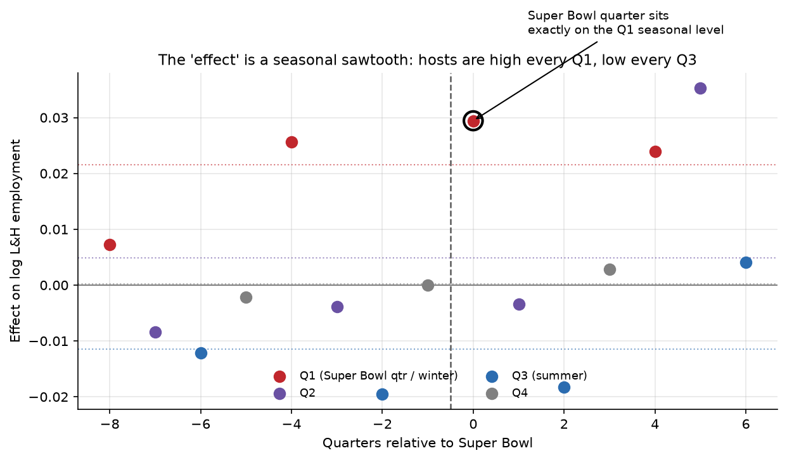

# Host-City Economics

A difference-in-differences study of whether hosting a sporting mega-event moves a city's economy — framed by the 2026 World Cup, measured on the Super Bowl, and built to show how a robust-looking result can still be an artifact.

## Overview

**Hosting the Super Bowl has no credible effect on local leisure & hospitality
employment.** A straightforward analysis says otherwise — it finds a **+2.9%**
employment bump in the host metro's Super Bowl quarter, and that number is stubborn:
it survives few-cluster-honest inference, a modern staggered-treatment estimator, and
a placebo that reassigns the Super Bowl to random comparable cities. Everything a
booster needs is there.

It is still an artifact. The bump fails one specific test — a placebo that moves the
Super Bowl to a *different date* in the same cities — and fails it because the
"effect" is **winter seasonality**. Super Bowls are always played in early February,
and host cities are disproportionately warm-weather tourism metros (Phoenix, Miami,
Tampa, New Orleans, Las Vegas) whose leisure & hospitality employment is seasonally
high every first quarter. Compared like-with-like — the Super Bowl quarter against the
*same host's other first quarters* — the effect is **+0.4% (se 0.5%), indistinguishable
from zero.**

That is the whole result in two numbers: a **+2.9% that looks real** and a **+0.4% that
is the truth**, with one falsification test standing between them. It lands exactly where
thirty years of ex-post mega-event economics has landed — the windfalls promised
before the event do not show up after it (Baade & Matheson 2016; Coates & Humphreys 2003).



*The whole finding in one figure. The naive event-study estimate for the Super Bowl quarter is
+2.9% and highly significant; net of seasonality — the same quarter compared with the host's
other first quarters — it is +0.4% and indistinguishable from zero.*

It is easy to produce a positive number for a mega-event and stop. The harder, more honest task —
the one the economics literature spent decades on — is to ask how much of that number is *real
new activity* versus an accounting illusion. So the project is organised around a single thesis:

> **No estimator, however modern, rescues the wrong estimand.** A robust, significant,
> replicable estimate of the wrong quantity is still wrong.

## Approach

The build runs in three stages, each a notebook, all calling the shared estimator library in
`src/did.py` — the single source of truth, so nothing is re-implemented downstream. Everything is
Python; there is no R dependency.

**Part 1 — Synthetic Validation.** The estimators are proved correct before they touch real data
(`notebooks/01`), against panels with *known* planted effects. A canonical 2×2 recovers a planted
ATT inside its confidence interval; a staggered-adoption panel with heterogeneous, exposure-growing
effects shows naive two-way fixed effects returning a biased number — a Goodman-Bacon decomposition
exposes the negatively-weighted "forbidden" comparisons behind the bias — while the Callaway &
Sant'Anna estimator recovers the truth. The same notebook plants the project's thesis in miniature:
a pure-displacement city whose event-facing sector gains exactly what its other sector loses, net
effect zero, where a naive reading reports a windfall and the honest reading of total employment
reports nothing. This is the Orlando-1994 story, simulated.

**Part 2 — Data and Design.** The anchor pivoted, deliberately, from the World Cup to the Super
Bowl. The project is motivated by the 2026 World Cup (hosted across the US, Mexico, and Canada),
but the World Cup itself cannot be the empirical anchor: its economic outcome data will not exist
for months — US metro employment is published by the BLS on a roughly six-month lag — and the 1994
US World Cup, the natural historical substitute, offers only a *single, simultaneous* treatment
(nine host cities in one summer) on bulk-only, SIC-reconstructed 1990s data with 1990s metro
boundaries. I checked both against the live BLS API before deciding. The Super Bowl is the honest
empirical vehicle: **one rotating host per year, eleven events over 2015–2025**, which is genuine
staggered timing on clean, modern, NAICS-based data — the setting the staggered-DiD methods are
actually built for. The cost is scope, and I state it throughout: **this measures Super Bowls, not
the World Cup.**

- **Outcome.** Metro leisure & hospitality employment, from the BLS Quarterly Census of
  Employment and Wages (QCEW) — free, quarterly, ~95% of US jobs. It is the variable the
  sectoral mega-event literature uses, and honestly a *proxy*: card-spending and
  hotel-occupancy data at city level is paywalled, so employment is the best free outcome,
  not the theoretically ideal one.
- **Treated units.** The 10 Super Bowl host metros, treated in the quarter of their game
  (always Q1).
- **Controls.** A **matched comparable-metro pool** — 18 host-caliber metros (large,
  major-league) that did not host in the window, matched to each host on pre-event size and
  tourism intensity. Naive non-host metros were rejected: hosts are *selected* (stadiums,
  hotels, market size), so an unmatched comparison would fail parallel trends by
  construction — the flaw that discredited early mega-event studies.
- **County → metro aggregation.** The brief anticipated that BLS had discontinued the
  MSA-level industry breakdown in Q2 2025, forcing manual county aggregation. I checked: that
  is not currently true (the MSA series is still published). I use the official MSA
  aggregates and *validate* that a manual county→metro sum reproduces them exactly (ratio
  1.000), so the manual method is on hand if the series is ever dropped.

The panel is 28 metros × 46 quarters (2014 Q1 – 2025 Q2). Disclosure-suppressed cells are
handled explicitly (two metros dropped for heavy suppression, four scattered cells
interpolated, the unpublished tail trimmed) rather than silently zeroed.

**COVID-19 sits in the middle of the window** and devastated leisure & hospitality employment
(a 35–50% collapse in 2020 Q2, with an uneven recovery), so the headline estimates **exclude
the 2020–2025 host cohorts** and use the five pre-COVID hosts (2015–2019), whose event windows
predate the pandemic. The exclusion changes what can be concluded, and I state both directions
honestly: the naive +2.9% event-quarter bump is present in *both* the pre-COVID and full
samples, so it does not depend on the restriction — but the seasonality-free null is clean
*only* on the pre-COVID cohorts. On the full sample the year-over-year first-quarter comparison
is contaminated, because the 2020 host's Super Bowl quarter (February 2020) falls immediately
before the collapse and so its Q1-to-Q1 comparison is biased upward (+2.75%, marginally
significant). The pre-COVID cohorts can separate the Super Bowl from the pandemic; the full
sample cannot. The finding is therefore a null on the sample where it can be identified cleanly,
and I do not claim it for the sample where it cannot.

**Part 3 — Estimation and Robustness.** The real-data estimate (`notebooks/03`) is a matched,
stacked event study — each host compared with its own matched controls, sub-experiment fixed
effects, clustered on metro — cross-checked with a Callaway & Sant'Anna estimate and then put
through the falsification gauntlet reported in [Key Findings](#key-findings). Two pieces of the
toolkit are worth being precise about:

- **Inference for few treated clusters.** The wild cluster bootstrap here is a **hand-rolled
  implementation**, and worth being precise about: `pyfixest`'s built-in bootstrap needs an
  external package and could not parse the interacted event-study design
  (`i(event_time, treated)`), so I implemented the restricted (null-imposed, Rademacher)
  bootstrap directly — partial out the two-way fixed effects by alternating projections
  (Frisch–Waugh–Lovell), then resample cluster-level signs on the restricted residuals. It is
  a focused, single-purpose routine, not a from-scratch bootstrap library, and I trusted it
  only after **validating its point estimates against `pyfixest` to five decimal places**.
- **Falsification** as a first-class step, not an appendix: in-space and in-time placebo
  tests, which are what actually decided this project.

## Key Results

| Test | Purpose | Result |
|------|---------|--------|
| Naive stacked event study (Super Bowl quarter) | the headline estimate | **+2.9%**, clustered *p* ≈ 0.0006 |
| Wild cluster bootstrap | honest inference with few treated clusters | effect survives, *p* ≈ 0.01 |
| Callaway & Sant'Anna | robustness to the staggered-treatment bias | +3.8%, CI grazes zero |
| In-space placebo (fake host cities) | is it specific to the host metros? | real effect beyond every draw, *p* = 0.002 |
| In-time placebo (fake dates) | is it specific to the Super Bowl date? | **+2.7% / +1.8% — it appears anyway** |
| Seasonality-free estimate (vs the host's other Q1s) | the like-with-like comparison | **+0.4% (se 0.5%), not significant** |

**Bottom line: no credible effect of hosting on local leisure & hospitality employment.** The
apparent windfall is winter seasonality in cities that happen to host in February — consistent
with thirty years of ex-post mega-event economics.

## Key Findings

The conclusion above is the destination. What makes it credible is the route: a sequence
of falsification tests, each run for a stated reason, not a hunt continued until something
broke. The apparent effect was put through a gauntlet designed to kill it, and it died only
at the test built to catch this exact confound.

**1. The naive estimate — a +2.9% windfall.**
A matched, stacked event study (Cengiz et al. 2019): each host metro compared with its own
matched controls over ±8 quarters, sub-experiment fixed effects, standard errors clustered
on metro. The Super Bowl-quarter coefficient is **+2.9%**, naive clustered *p* ≈ 0.0006.

**2. Does it survive honest inference? — Yes.**
*Purpose:* with only 5–10 treated clusters, cluster-robust standard errors are badly
anti-conservative — a problem visible earlier in the project as 93% coverage of nominal-95%
intervals in the synthetic checks. The fix is the wild cluster bootstrap. Under it, the
Super Bowl-quarter effect stays significant (*p* ≈ 0.01). And a bonus: the same bootstrap
*overturns* an earlier, naive rejection of parallel trends (joint pre-trends *p* moves from
0.0005 to 0.18) — the design's key assumption was being rejected only by the unreliable
inference, not by the data. Honest inference made the effect look *more* real, not less.

**3. Is it an artifact of the staggered-treatment bias? — No.**
*Purpose:* under staggered timing with heterogeneous effects, naive two-way fixed effects is
biased (Goodman-Bacon 2021; demonstrated in notebook `01`), so the bump could be a known
methodological artifact rather than anything in the data. The Callaway & Sant'Anna estimator,
which avoids those "forbidden" comparisons, returns a positive overall ATT (**+3.8%**, CI
grazing zero). This confirms the effect survives the *staggered-treatment* problem — **not**
that it is real. Callaway–Sant'Anna fixes two-way-fixed-effects bias; it does nothing about
seasonal confounding, because no estimator does. That is the thesis, and it is why the next
two tests, not this one, decide the question.

**4. Is it specific to the cities that hosted? — Yes.**
*Purpose:* a generic artifact would appear for any comparable city. Reassigning "treatment"
to a random matched control 500 times (an in-space placebo, i.e. randomization inference —
itself robust to few clusters) puts the real effect beyond **every** placebo draw,
permutation *p* = 0.002. The bump is genuinely a property of the host metros.

**5. Is it specific to the Super Bowl *date*? — No. This is where it breaks.**
*Purpose:* if the effect is caused by the Super Bowl, it should not appear when the Super
Bowl didn't happen. Pretending the game was a year earlier — a different first quarter in the
same cities — reproduces almost the identical bump (**+2.7%**); two years earlier, **+1.8%**.
An "effect" that shows up at dates when nothing happened is not an effect of the event.

**6. Diagnosis and the honest number.**
Steps 4 and 5 are only consistent with a fixed feature of host metros that recurs every year
in this part of the calendar. Colouring the event-study coefficients by calendar quarter
confirms it — a seasonal sawtooth, Q1 high and Q3 low, with the Super Bowl quarter sitting on
the ordinary Q1 level. **The apparent effect is seasonal, not causal.** Removing seasonality
entirely — comparing the Super Bowl's Q1 to the same host's *other* Q1s, in an annual
first-quarters-only event study — gives **+0.4% (se 0.5%)**, the null shown in the figure at
the top.



*Event-study coefficients coloured by calendar quarter. Every first quarter (red) is elevated
by ~2–3% and every third quarter depressed by ~2%, relative to matched controls. Because every
Super Bowl falls in Q1, its event-quarter estimate (circled) sits on the ordinary seasonal
peak.*

For a recruiter reading in thirty seconds: **the apparent Super Bowl employment boost is
seasonal confounding; there is no credible local effect.** For the reader who wants the
mechanism: the number survived a bootstrap, a modern estimator, and a city-placebo, and was
undone by a date-placebo, because a fixed-calendar event in seasonally-selected cities
confounds the treatment quarter with the season.

**The same lesson, twice.** The synthetic displacement scenario (notebook `01`) and the real
seasonality finding (notebook `03`) are the same point in two settings. In simulation, a naive
reading of the event-facing sector reports a windfall while the honest reading of total
employment reports nothing; on real data, the naive reading reports +2.9% while the honest
reading, once seasonality is removed, reports nothing. The synthetic half exists precisely so
that when the real half returns a null, it is credibly a finding about the world rather than a
failure of the tools — the machinery is *proven* to recover real effects when they exist before
it is ever pointed at messy data.

**Two habits did the real work**, and both were flagged stages earlier. Honest few-cluster
inference cut *both* ways — it overturned the naive parallel-trends rejection and refused to let
tight naive standard errors oversell the bump; honest inference is not a synonym for "make
everything insignificant". And placebo testing is what actually decided the question: without the
in-time placebo, a careful analyst with clean data, a modern estimator, and a robust bootstrap
would have published a false 3% windfall.

## Limitations

Named here rather than left for the reader to find:

- **A single event type.** This is the Super Bowl — one game, one week, in Q1 — not the World
  Cup it is framed by, and not mega-events in general. The anchor pivot is defensible (it is
  what the data supports) but it is a real narrowing of scope.
- **Employment is a proxy.** A one-week visitor surge need not move the payroll headcount QCEW
  counts; the true spending response could be larger or smaller than the employment response.
  A null on employment is not automatically a null on all economic activity.
- **Few treated clusters.** With 5–10 hosts, inference is *bracketed*, not pinned. The wild
  cluster bootstrap helps but cannot manufacture power; the naive and bootstrap p-values
  bound the truth between them.
- **A seasonality confound inherent to the design.** Because every Super Bowl is in Q1, the
  treatment quarter is inseparable from the season *within* this event, and the fix — comparing
  to the same hosts' other Q1s — is a restriction, not a clean identification. A mix of
  treatment seasons would have separated the two directly.
- **US-only, observational.** The cleanest free city-level data is US; Mexican and Canadian
  city data is thinner and was not harmonised. All causal claims are bounded by the stated
  assumptions.

## Tech Stack

Python · pandas · NumPy · SciPy · statsmodels · differences (Callaway–Sant'Anna) · pyfixest · linearmodels · Matplotlib · JupyterLab

## Reproduce

Built and verified on CPython 3.12 (Windows). The causal stack (`differences`, `pyfixest`,
`linearmodels`) is pinned in `requirements.txt` and was confirmed to import and *run* under
`numpy` 2.x / `pandas` 3.x.

```powershell
py -3.12 -m venv .venv
.\.venv\Scripts\Activate.ps1
python -m pip install --upgrade pip
pip install -r requirements.txt
python -m ipykernel install --user --name host-city-economics
jupyter lab
```

On macOS/Linux: `python3 -m venv .venv && source .venv/bin/activate && pip install -r
requirements.txt`. Run the notebooks in order; `01` needs no network, `02`/`03` download QCEW
slices (cached locally after the first run). All randomness derives from the committed seed in
`src/config.py`.

## Structure

- `src/config.py` — seeds and paths; the single source of reproducibility.
- `src/generate_panel.py` — three seeded synthetic DGPs with planted effects.
- `src/data_prep.py` — QCEW download, county→metro aggregation, matched-control construction.
- `src/did.py` — the estimator library: 2×2, event study, TWFE, Goodman-Bacon, Callaway–Sant'Anna, stacked event study, wild cluster bootstrap, placebos.
- `notebooks/01_synthetic-validation.ipynb` — proof-of-correctness and the displacement lesson.
- `notebooks/02_data-and-design.ipynb` — the real panel, matched controls, parallel-trends check.
- `notebooks/03_estimation-and-robustness.ipynb` — the gauntlet, and the null.
- `data/` — committed panels (synthetic + real); the QCEW slice cache is git-ignored.
- `results/` — event-study and diagnostic figures.
- `PROJECT_BRIEF.md` — the full specification and rationale.

The build history is honest: the repository was committed stage by stage, synthetic validation
first and this README last, so the git log reflects a real build rather than a reverse-engineered
story.

## References

- Baade, R. & Matheson, V. (2016). *Going for the Gold: The Economics of the Olympics.*
  Journal of Economic Perspectives.
- Coates, D. & Humphreys, B. (2003). *The Effect of Professional Sports on Earnings and
  Employment in the Services and Retail Sectors in US Cities.* Regional Science and Urban
  Economics.
- Callaway, B. & Sant'Anna, P. (2021). *Difference-in-Differences with Multiple Time Periods.*
  Journal of Econometrics.
- Goodman-Bacon, A. (2021). *Difference-in-Differences with Variation in Treatment Timing.*
  Journal of Econometrics.
- Cengiz, Dube, Lindner & Zipperer (2019). *The Effect of Minimum Wages on Low-Wage Jobs.*
  Quarterly Journal of Economics. (Stacked event-study design.)
- MacKinnon, J. & Webb, M. (2017). *Wild Bootstrap Inference for Wildly Different Cluster
  Sizes.* Journal of Applied Econometrics.

*The synthetic panels are generated for demonstration and labelled as such. The real-data
analysis uses public BLS QCEW employment data and is observational; its causal claims are
bounded by the assumptions stated in the notebooks.*
